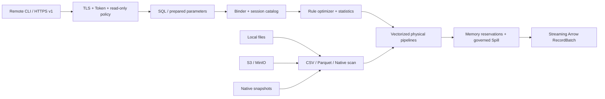

<div align="center">

# RustDB

**A single-node OLAP engine for CSV, Parquet, S3, persistent Native analytics, and a secure read-only HTTPS Shell.**

[简体中文](README.zh-CN.md) · [HTTP Shell](docs/http-shell.md) · [Architecture](docs/architecture.md) · [SQL compatibility](docs/compatibility.md) · [CLI guide](packaging/dist/CLI.md)

[](https://github.com/SamuelSupe/RustDB/actions/workflows/ci.yml)
[](https://github.com/SamuelSupe/RustDB/actions/workflows/dist.yml)
[](Cargo.toml)
[](rust-toolchain.toml)
[](LICENSE)

</div>

> [!WARNING]
> RustDB is experimental alpha software. It is suitable for evaluation,
> development, and reproducible engine research, but its storage format and
> public API are not yet production-stable.

RustDB queries CSV and Parquet directly from local disks or S3-compatible
object stores. Data can optionally be imported into an immutable, persistent
Native database for repeated local analytics. Results are streamed as Apache
Arrow `RecordBatch` values through the Rust API and local CLI. v0.9 optionally
serves one Native database through a TLS-only, read-only HTTP Shell while the
official remote CLI preserves `table`, `csv`, and `jsonl` output.

The SQL binder, optimizer, vectorized operators, scheduler, memory accounting,
Native storage, and Spill implementation live in this repository. DataFusion
is not a runtime dependency, and project code forbids `unsafe`.

## Why RustDB?

- **Query data where it lives** — local paths, globs, `file://`, AWS S3, and
  MinIO/S3-compatible endpoints.
- **Fast columnar paths** — projection and predicate pushdown, Parquet
  row-group/page-index/Bloom pruning, runtime filters, and metadata
  singleflight.
- **High-throughput CSV** — raw, gzip, and zstd input with quote-aware framing
  and bounded parallel decoding of a single large file.
- **Persistent Native analytics** — transactional DML/DDL, stable row versions,
  checksummed WAL recovery, snapshot isolation, maintenance, and verified
  local/S3 backup and restore.
- **Resource-aware execution** — multi-lane pipelines, global/query memory
  budgets, cancellation, bounded queues, and governed Spill for blocking
  operators.
- **Embedded by default, remote when needed** — use the focused Rust API and
  local streaming CLI, or expose one Native database through an authenticated,
  read-only HTTPS Shell.

## At a glance

| Area | Current v0.9 alpha scope |
| --- | --- |
| Sources | CSV, gzip CSV, zstd CSV, Parquet |
| Storage | Local filesystem, S3/MinIO, persistent local Native database |
| Interfaces | Embedded Rust API, local CLI/REPL, read-only HTTPS Shell and remote CLI |
| Output | Streaming Arrow locally; paged JSON/NDJSON remotely; `table`/`csv`/`jsonl` CLI rendering |
| Execution | Vectorized, multi-lane, memory-accounted, Spill-capable |
| SQL | TPC-H-oriented analytics, joins, aggregates, windows, set operations, prepared parameters |
| Safety | Project code uses `#![forbid(unsafe_code)]` |

See the [compatibility matrix](docs/compatibility.md) for the authoritative SQL,
type, and format boundary.

## Quick start

### Build a distribution with OrbStack

The default development and packaging path uses OrbStack's Docker engine:

```sh
git clone https://github.com/SamuelSupe/RustDB.git
cd RustDB
scripts/dist/build.sh
```

The command writes a versioned archive and SHA-256 file to `dist/`, then
validates English/Chinese help, installation, execution, and uninstallation.
Use `scripts/dist/build.sh --native` on a host with the pinned Rust toolchain to
build for the current native platform.

### Query files directly

```sh
cargo run --locked --release --bin rustdb -- \
  --threads 4 \
  --memory-limit 2GiB \
  -c "SELECT count(*) FROM read_parquet('/data/events/*.parquet')"
```

```sql
SELECT country, count(*) AS events
FROM read_csv('/data/events/*.csv.gz', compression = 'auto')
WHERE event_date >= DATE '2026-01-01'
GROUP BY country
ORDER BY events DESC
LIMIT 20;
```

Omit `-c` and `-f` to open the REPL. Output formats are `table`, `csv`, and
`jsonl`. Run `rustdb --help`, `rustdb --help-zh`, or `.help zh` in the REPL for
bilingual help.

### Query S3 or MinIO

AWS credentials come only from the default credential chain or an embedding
application's credential provider. RustDB does not expose plaintext secret
flags.

```sh
AWS_PROFILE=analytics rustdb --s3-region us-east-1 -c \
  "SELECT count(*) FROM read_parquet('s3://analytics/events/*.parquet')"
```

```sh
rustdb \
  --s3-endpoint http://127.0.0.1:9000 \
  --s3-region us-east-1 \
  --s3-path-style \
  --s3-allow-http \
  -c "SELECT * FROM read_parquet('s3://demo/events/*.parquet') LIMIT 10"
```

See [S3 configuration](docs/s3.md) for AWS, anonymous access, and MinIO.

### Serve a Native database read-only

Run one TLS server for one Native database. The default listener is loopback;
remote binding requires an explicit HTTPS advertise URL.

```sh
rustdb datasource add-parquet \
  --database /srv/rustdb/analytics \
  --name sales \
  --location 's3://lake/sales/*.parquet'
rustdb serve --database /srv/rustdb/analytics

rustdb serve \
  --database /srv/rustdb/analytics \
  --listen 0.0.0.0:7400 \
  --advertise-url https://analytics.example.com:7400 \
  --result-ttl-secs 3600 \
  --result-global-limit 10GiB \
  --result-query-limit 2GiB
```

The first start creates a local CA, renewable server certificate, and random
Bearer Token. Stop the server, export its Profile bundle, transfer it over a
trusted channel, import it on the client, then query with the existing CLI
experience:

```sh
rustdb profile export \
  --database /srv/rustdb/analytics \
  --output analytics.rustdb-profile
rustdb profile import analytics.rustdb-profile --name analytics
rustdb shell --profile analytics -c \
  "SELECT region, count(*) FROM sales GROUP BY region" --format table
rustdb shell --profile analytics -f report.sql --format csv >report.csv
```

Remote SQL is deliberately narrower than local SQL: query, metadata, and
explain statements only. DDL/DML, maintenance, uploads, direct file table
functions, and remote data-source administration are rejected. Persistent
CSV/Parquet sources are managed locally with `rustdb datasource` while the
server is stopped. `serve` can independently configure result retention with
`--result-directory`, `--result-ttl-secs`, `--result-global-limit`, and
`--result-query-limit`; it also accepts `--s3-region`, `--s3-endpoint`,
`--s3-path-style`, `--s3-allow-http`, and `--s3-anonymous` for server-local
registered sources. See the [HTTP Shell guide](docs/http-shell.md) and
[OpenAPI 3.1 contract](docs/openapi-v1.yaml).

## Embed RustDB

```rust,no_run
use futures::StreamExt;
use rustdb::{Engine, EngineConfig, ParquetOptions};

# async fn run() -> rustdb::Result<()> {
let engine = Engine::new(EngineConfig::default())?;
let session = engine.session();

session
    .register_parquet(
        "events",
        ["/data/events/*.parquet"],
        ParquetOptions::default(),
    )
    .await?;

let mut result = session
    .execute("SELECT country, count(*) FROM events GROUP BY country")
    .await?;

while let Some(batch) = result.stream().next().await {
    println!("{:?}", batch?);
}
# Ok(())
# }
```

The public result remains streaming: callers decide whether and when to
collect it. Dropping or cancelling a query converges its task group before
query Spill is cleaned up.

## Persistent Native database

`Engine::new` is ephemeral. `Engine::open` enables a persistent local database
whose immutable segments can be populated directly from CSV or Parquet:

```rust,no_run
use futures::StreamExt;
use rustdb::{Engine, EngineConfig};

# async fn import() -> rustdb::Result<()> {
let engine = Engine::open("./warehouse", EngineConfig::default())?;
let session = engine.session();

let mut write = session
    .execute(
        "CREATE TABLE events AS \
         SELECT * FROM read_parquet('/data/events/*.parquet')",
    )
    .await?;

while let Some(batch) = write.stream().next().await {
    batch?;
}
# Ok(())
# }
```

`INSERT`, `UPDATE FROM`, `DELETE USING`, `TRUNCATE`, DML `RETURNING`, and safe
transactional table/view DDL use the same publication protocol. Running queries
keep their pinned snapshot while later queries see the new Catalog generation.
The checksummed WAL, stable row identities, delete vectors, optimistic
multi-writer snapshot isolation, and typed transaction API survive restart.

Native quotas are optional hard commit limits. The engine limit covers the
complete database directory and commit-publication headroom; table limits
cover current, retained, staged, and transaction snapshots. Configure an
engine limit, a default table limit, and explicit overrides when opening:

```rust,no_run
use rustdb::{Engine, EngineConfig};

# fn open() -> rustdb::Result<()> {
let config = EngineConfig::builder()
    .native_engine_limit_bytes(Some(20 << 30))
    .native_default_table_limit_bytes(Some(5 << 30))
    .native_table_limit_bytes("events", 10 << 30)
    .build();
let engine = Engine::open("./warehouse", config)?;
# Ok(())
# }
```

Quota values are supplied on every open and are not persisted. A rejected
write reports structured engine/table, current, new, peak, and limit bytes.

Persistent objects use `main` by default and may be addressed as
`schema.object`. RustDB supports `CREATE SCHEMA`, `DROP SCHEMA`, `SHOW SCHEMAS`,
and `information_schema.schemata`; qualified names work across DML, DDL, COPY,
and maintenance. Transactional mutation results must be consumed to
end-of-stream: cancellation or abandonment after staging rolls back the
transaction. A `CopyPostCommitFailure` means COPY output is already durable and
must not be retried.

Commit failures have explicit terminal meaning. `NativeCommitPostCommitFailure`
means the transaction is committed; `Transaction::commit_info()` retains its
generation. `CommitOutcomeUnknown` leaves the transaction indeterminate: do not
retry `commit` or `rollback` on that handle, reopen the database, and reconcile
the visible Catalog generation before issuing another write. SQL `COMMIT`
follows the same rule and clears the session's active transaction.

The CLI opens this database with `rustdb --database ./warehouse`. Existing
v0.7 databases remain read-only until `rustdb migrate ./warehouse` validates
the source, creates or verifies an exact `.v0.7-backup` catalog snapshot, and
atomically enables the v0.8 WAL.
Consistent backup and restore are available for local directories and S3:

```sh
rustdb backup ./warehouse ./warehouse-backup
rustdb --s3-region us-east-1 backup ./warehouse s3://bucket/rustdb/snapshot
rustdb restore ./warehouse-backup ./warehouse-restored
```

If an embedded caller abandons an in-flight remote-backup future, RustDB keeps
the Engine-owned upload running until it either publishes a complete manifest
or aborts multipart uploads and removes unmanifested objects. A process or host
crash cannot run that cleanup; configure the bucket's incomplete-multipart
lifecycle policy as an operational backstop. A crash after multipart completion
but before manifest publication can leave a completed unreachable object.
RustDB refuses to append more data to that non-empty manifest-less destination;
inspect and remove the dedicated destination prefix before retrying.
Local remote-backup/restore work directories are private, ownership-marked,
and locked. Expired crash leftovers are reclaimed conservatively on Engine
startup; unknown, forged, symlinked, fresh, or active paths are never removed.

## Architecture



Arrow `RecordBatch` is the exchange format. Scan, Filter, and Projection are
fused where safe; Aggregate, Join, Sort, and Window form controlled pipeline
breakers. Internal batches carry memory leases through bounded queues. Query
workers belong to one cancellation-aware task group, and blocking operators
switch to partitioned Spill when reservations cannot be satisfied.

The full execution model is documented in [architecture.md](docs/architecture.md).

## Functional status

- The v0.8 release-candidate gate passed one focused OrbStack reliability run,
  including live-MinIO CSV/Parquet COPY and Native backup/restore. See the
  [acceptance contract](docs/acceptance.md) and
  [release notes](docs/releases/v0.8.0-alpha.1.md).
- The v0.9 release gate adds one complete HTTP Shell correctness run covering
  TLS/Profile bootstrap, authentication, read-only policy, Query lifecycle,
  pagination, cancellation, quotas, cleanup, and all three CLI renderers; it
  intentionally adds no performance threshold or long soak.
- TPC-H Q1-Q22 query coverage is retained in [`benchmarks/tpch`](benchmarks/tpch).
- The v0.7 functional ClickBench gate runs all 43 official queries once in a
  four-CPU/16-GiB container profile.
- The retained one-million-row run completed **43/43 queries**; its manifest is
  [`20260717-functional-1m-4c16g.json`](benchmarks/clickbench/evidence/20260717-functional-1m-4c16g.json).

That ClickBench run is a compatibility and reliability check, not a published
cross-engine performance claim. The opt-in 100M profile and reproduction steps
are in the [ClickBench guide](benchmarks/clickbench/README.md).

## Current boundaries

Serializable isolation, savepoints, `MERGE`/upsert, constraints, indexes,
public time travel, distributed execution, and DuckDB database-file/SQL
compatibility are outside v0.9. The HTTP surface is a read-only remote Shell,
not a write API, browser UI, multi-user service, session protocol, or generated
SDK. JSON/ORC/Iceberg scans and nested LIST/STRUCT/MAP execution are also
excluded. Result order is unspecified without an outer `ORDER BY`.

## Documentation

| Document | Purpose |
| --- | --- |
| [Architecture](docs/architecture.md) | Pipelines, scheduling, memory, pruning, Native storage, and Spill |
| [Compatibility](docs/compatibility.md) | Supported SQL, types, formats, and explicit limitations |
| [CLI guide](packaging/dist/CLI.md) / [中文](packaging/dist/CLI.zh-CN.md) | Commands, output, resources, and S3 flags |
| [HTTP Shell](docs/http-shell.md) / [中文](docs/http-shell.zh-CN.md) | TLS, Profiles, read-only SQL, Query lifecycle, and operations |
| [OpenAPI v1](docs/openapi-v1.yaml) | Public versioned HTTP contract |
| [Installation](packaging/dist/INSTALL.md) / [中文](packaging/dist/INSTALL.zh-CN.md) | Binary package installation and removal |
| [S3 and MinIO](docs/s3.md) | Credentials, endpoints, and object-store behavior |
| [Troubleshooting](docs/troubleshooting.md) | Resource, Spill, corruption, and input errors |
| [Acceptance](docs/acceptance.md) | Correctness and release checks |
| [v0.8 release notes](docs/releases/v0.8.0-alpha.1.md) | New transactional Native storage, SQL, COPY, and operations surface |
| [v0.7 migration](docs/migration-v0.7.md) | Historical execution-core and benchmark changes |
| [v0.8 migration](docs/migration-v0.8.md) | WAL format, explicit database migration, and transaction API |
| [v0.8 roadmap](docs/roadmap-v0.8.md) | Native v3, DML/DDL, COPY/maintenance, and SQL/time delivery stages |
| [v0.9 release notes](docs/releases/v0.9.0-alpha.1.md) | Read-only HTTPS Shell and release boundaries |
| [v0.9 migration](docs/migration-v0.9.md) | Upgrade, Profile, server state, and rollback guidance |

## Development

The complete default verification path runs through OrbStack:

```sh
scripts/ci/orbstack.sh all
```

This release gate intentionally excludes the dedicated low-memory Spill
stress cases; run `scripts/ci/orbstack.sh test` when investigating that
execution path.

Focused commands are also available:

```sh
docker compose run --rm dev cargo fmt --check
docker compose run --rm dev cargo clippy --all-targets -- -D warnings
docker compose run --rm dev cargo test --all-targets
```

Please keep operators and data sources small and single-purpose, preserve
streaming result semantics, and do not introduce project-owned `unsafe` or a
DataFusion runtime dependency.

## License

RustDB is licensed under the [Apache License 2.0](LICENSE).
