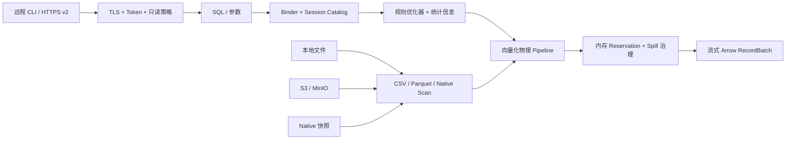

<div align="center">

# RustDB

**面向 CSV、Parquet、S3、Native 持久化分析与安全只读 HTTPS Shell 的单机 OLAP 引擎。**

[English](README.md) · [运维指南](docs/operator-guide.zh-CN.md) · [HTTP Shell](docs/http-shell.zh-CN.md) · [架构](docs/architecture.md) · [SQL 兼容范围](docs/compatibility.md) · [CLI 帮助](packaging/dist/CLI.zh-CN.md)

[](https://github.com/SamuelSupe/RustDB/actions/workflows/ci.yml)
[](https://github.com/SamuelSupe/RustDB/actions/workflows/dist.yml)
[](Cargo.toml)
[](rust-toolchain.toml)
[](LICENSE)

</div>

> [!WARNING]
> RustDB Beta 仍是预生产软件，适合功能评估、开发与可复现的引擎研究。Beta 2
> 会重置格式、配置和 HTTP 协议；请新建数据库与服务状态，不要迁移 Beta 1 产物。
> 当前尚不提供生产 SLA。

RustDB 可以直接查询本地磁盘或 S3-compatible 对象存储中的 CSV 和
Parquet，也可以把数据批量导入不可变分段的 Native 数据库，用于重复的本地分析。
Rust API 与本地 `rustdb` CLI 都以 Apache Arrow `RecordBatch` 流式返回结果。Beta
还可通过只启用 TLS 的只读 HTTP Shell 服务一个 Native 数据库，官方远程 CLI 继续
提供 `table`、`csv` 和 `jsonl` 输出。

SQL Binder、优化器、向量化算子、调度器、内存记账、Native 存储与 Spill
均由本项目实现；运行时不依赖 DataFusion，项目代码禁止使用 `unsafe`。

## 为什么是 RustDB？

- **直接查询数据源**：支持普通路径、glob、`file://`、AWS S3 和
  MinIO/S3-compatible endpoint。
- **高效列式路径**：投影/谓词下推、Parquet row-group/page-index/Bloom
  裁剪、运行时过滤器和元数据 singleflight。
- **高速 CSV**：支持原始、gzip、zstd 输入，并以 quote-aware framing
  安全地并行解析单个大文件。
- **Native 持久化分析**：支持事务 DML/DDL、稳定行版本、带校验和的 WAL
  恢复、快照隔离、维护，以及包含 Native 数据和安全 HTTP 控制状态的本地/S3
  服务备份包。
- **资源受控执行**：多 lane pipeline、引擎/查询内存预算、有界队列、取消，
  以及受配额和磁盘余量治理的 Spill。
- **默认嵌入，按需远程**：既可使用精简 Rust API 和本地流式 CLI，也可通过认证的
  只读 HTTPS Shell 暴露一个 Native 数据库。

## 能力概览

| 领域 | v1.0 Beta 当前范围 |
| --- | --- |
| 数据格式 | CSV、gzip CSV、zstd CSV、Parquet |
| 存储 | 本地文件系统、S3/MinIO、本地持久化 Native 数据库 |
| 接口 | 嵌入式 Rust API、本地 CLI/REPL、只读 HTTPS Shell 与远程 CLI |
| 输出 | 本地流式 Arrow；远程序列化 Arrow IPC 与分页 JSON/NDJSON；CLI 渲染 `table`/`csv`/`jsonl` |
| 执行 | 向量化、多 lane、内存记账、支持 Spill |
| SQL | 面向 TPC-H 的分析 SQL、Join、聚合、窗口、集合运算、参数化查询 |
| 安全 | 项目代码使用 `#![forbid(unsafe_code)]` |

准确的 SQL、类型和格式边界请以[兼容矩阵](docs/compatibility.md)为准。

## 快速开始

### 使用 OrbStack 构建发行包

默认开发与打包路径使用 OrbStack 的 Docker 引擎：

```sh
git clone https://github.com/SamuelSupe/RustDB.git
cd RustDB
scripts/dist/build.sh
```

命令会在 `dist/` 生成带版本号的压缩包和 SHA-256 文件，并验证中英文帮助、
安装、运行和卸载。已安装固定 Rust 工具链的原生主机可以运行
`scripts/dist/build.sh --native`，为当前平台构建。

### 直接查询文件

```sh
cargo run --locked --release --bin rustdb -- \
  --threads 4 \
  --memory-limit 2GiB \
  -c "SELECT count(*) FROM read_parquet('/data/events/*.parquet')"
```

```sql
SELECT country, count(*) AS events
FROM read_csv('/data/events/*.csv.gz', compression = 'auto')
WHERE event_date >= DATE '2026-01-01'
GROUP BY country
ORDER BY events DESC
LIMIT 20;
```

不传 `-c` 和 `-f` 会进入 REPL。输出格式包括 `table`、`csv` 和 `jsonl`。
可以运行 `rustdb --help`、`rustdb --help-zh`，或在 REPL 中执行 `.help zh`
查看双语帮助。

### 查询 S3 或 MinIO

AWS 凭证只从默认凭证链或嵌入应用提供的 credential provider 获取；RustDB
不会提供明文 secret CLI 参数。

```sh
AWS_PROFILE=analytics rustdb --s3-region us-east-1 -c \
  "SELECT count(*) FROM read_parquet('s3://analytics/events/*.parquet')"
```

```sh
rustdb \
  --s3-endpoint http://127.0.0.1:9000 \
  --s3-region us-east-1 \
  --s3-path-style \
  --s3-allow-http \
  -c "SELECT * FROM read_parquet('s3://demo/events/*.parquet') LIMIT 10"
```

AWS、匿名访问和 MinIO 配置请参阅 [S3 配置](docs/s3.md)。

### 只读服务 Native 数据库

一个 TLS 服务进程只打开一个 Native 数据库。默认监听回环地址；远程监听必须显式
提供客户端可达的 HTTPS advertise URL。

```sh
rustdb datasource add-parquet \
  --database /srv/rustdb/analytics \
  --name sales \
  --location 's3://lake/sales/*.parquet'
rustdb serve --database /srv/rustdb/analytics

rustdb serve \
  --database /srv/rustdb/analytics \
  --listen 0.0.0.0:7400 \
  --advertise-url https://analytics.example.com:7400 \
  --result-ttl-secs 3600 \
  --result-global-limit 10GiB \
  --result-query-limit 2GiB
```

首次启动会生成本地 CA、可续签服务端证书、Admin principal 和随机 Profile Token；
principal 目录只保存 Token 的 SHA-256 digest。停止服务并导出
Profile 包，通过可信渠道传输，在客户端导入后即可保留原有 CLI 使用体验：

```sh
rustdb profile export \
  --database /srv/rustdb/analytics \
  --output analytics.rustdb-profile
rustdb profile import analytics.rustdb-profile --name analytics
rustdb shell --profile analytics -c \
  "SELECT region, count(*) FROM sales GROUP BY region" --format table
rustdb shell --profile analytics -f report.sql --format csv >report.csv
```

服务停止时使用本地 `rustdb principal list|create|set-enabled|set-role` 与
`rustdb token list|rotate|revoke` 管理 Query/Admin 身份。Token 列表只输出 UUID、
principal、生命周期状态和有效期，绝不输出 secret 或 digest。可按 UUID 导出普通
principal 的 Profile，并复用服务端已管理连接包的 URL 与 CA；需要覆盖地址时再增加
`--server-url`：

```sh
rustdb token list --database /srv/rustdb/analytics --principal analyst
rustdb profile export --database /srv/rustdb/analytics \
  --token-id <UUID> --output analyst.rustdb-profile
```

Query 角色只能访问自己的 Query ID，Admin 可以访问所有 Query。

远程 SQL 刻意比本地 SQL 更窄：只允许查询、元数据和 Explain 语句；DDL/DML、维护、
上传、直接文件表函数及远程数据源管理都会被拒绝。持久化 CSV/Parquet 源只能在服务
停止时通过本地 `rustdb datasource` 管理。`serve` 可独立配置结果保留：
`--result-directory`、`--result-ttl-secs`、`--result-global-limit`、
`--result-query-limit`；服务端本地注册源还可使用 `--s3-region`、`--s3-endpoint`、
`--s3-path-style`、`--s3-allow-http`、`--s3-anonymous`。详见
[HTTP Shell 中文指南](docs/http-shell.zh-CN.md)和 [OpenAPI 3.1 协议](docs/openapi-v2.yaml)。

需要生成脱敏、只读的支持快照时，可运行
`rustdb diagnostics --database 路径 [--output 文件]`，详见
[诊断报告指南](docs/diagnostics.zh-CN.md)。

## 嵌入 RustDB

```rust,no_run
use futures::StreamExt;
use rustdb::{Engine, EngineConfig, ParquetOptions};

# async fn run() -> rustdb::Result<()> {
let engine = Engine::new(EngineConfig::default())?;
let session = engine.session();

session
    .register_parquet(
        "events",
        ["/data/events/*.parquet"],
        ParquetOptions::default(),
    )
    .await?;

let mut result = session
    .execute("SELECT country, count(*) FROM events GROUP BY country")
    .await?;

while let Some(batch) = result.stream().next().await {
    println!("{:?}", batch?);
}
# Ok(())
# }
```

公开结果始终保持流式，是否收集以及何时收集由调用者决定。查询被取消或结果被
丢弃后，TaskGroup 会先收敛，再清理该查询的 Spill。

## Native 持久化数据库

`Engine::new` 是临时会话；`Engine::open` 会打开本地持久化数据库，可以直接从
CSV 或 Parquet 导入不可变分段：

```sh
rustdb import --database ./warehouse --table events \
  --location /data/events.csv.gz --format csv \
  --import-id events-2026-07-19 --header present --compression auto
```

`import_id` 是永久幂等键：完全相同的请求会直接返回持久回执，不重新读取数据源；
修改请求则返回 `native.import_conflict`。嵌入式调用方使用同一契约的
`Session::import`。这是 CSV/Parquet 直接进入 Native 的推荐路径，详见
[幂等 Native 导入](docs/native-import.md)。需要先执行 SQL 变换时再使用 CTAS：

```rust,no_run
use futures::StreamExt;
use rustdb::{Engine, EngineConfig};

# async fn import() -> rustdb::Result<()> {
let engine = Engine::open("./warehouse", EngineConfig::default())?;
let session = engine.session();

let mut write = session
    .execute(
        "CREATE TABLE events AS \
         SELECT * FROM read_parquet('/data/events/*.parquet')",
    )
    .await?;

while let Some(batch) = write.stream().next().await {
    batch?;
}
# Ok(())
# }
```

`INSERT`、`UPDATE FROM`、`DELETE USING`、`TRUNCATE`、DML `RETURNING`，以及
安全的事务化表/View DDL 都使用同一发布协议。进行中的查询继续读取已固定快照，
后续查询看到新的 Catalog generation。带校验和的 WAL、稳定行 ID、delete vector、
乐观多写者快照隔离及类型化事务 API 均支持重启恢复。

Native 配额是可选的提交硬限制。引擎配额覆盖完整数据库目录及提交发布所需
余量；表配额覆盖当前、保留、暂存和事务快照。打开数据库时可以配置引擎
配额、默认表配额和指定表覆盖值：

```rust,no_run
use rustdb::{Engine, EngineConfig};

# fn open() -> rustdb::Result<()> {
let config = EngineConfig::builder()
    .native_engine_limit_bytes(Some(20 << 30))
    .native_default_table_limit_bytes(Some(5 << 30))
    .native_table_limit_bytes("events", 10 << 30)
    .build();
let engine = Engine::open("./warehouse", config)?;
# Ok(())
# }
```

配额需要在每次打开时提供，不会写入数据库。写入被拒绝时会返回结构化错误，
包含引擎或表、当前字节、新增字节、峰值字节及限制字节。

持久对象默认位于 `main` schema，也可使用 `schema.object`。RustDB 支持
`CREATE SCHEMA`、`DROP SCHEMA`、`SHOW SCHEMAS` 与
`information_schema.schemata`，限定名可贯穿 DML、DDL、COPY 和维护命令。
事务内 mutation 的结果必须消费到 EOS；若在 staged 后取消或放弃结果，整个
事务会回滚。`CopyPostCommitFailure` 表示 COPY 输出已经持久化，不应重试同一
目标。

提交错误具有明确的终态语义。`NativeCommitPostCommitFailure` 表示事务已经
提交，`Transaction::commit_info()` 仍可取得其 generation；
`CommitOutcomeUnknown` 表示事务结果不确定，不应在原句柄上再次 `commit` 或
`rollback`，而应重新打开数据库，核对可见 Catalog generation 后再写入。SQL
`COMMIT` 遵循同一规则，并会清除 Session 中的活动事务。

CLI 使用 `rustdb --database ./warehouse` 打开数据库。Beta 启用新的 Native
兼容 epoch，并会在不修改目录的前提下拒绝 alpha 数据库。请将 CSV/Parquet 重新导入
新的 Beta 目录；`rustdb migrate PATH` 现在只负责格式校验，不做 alpha 原地迁移。
详见 [Beta 迁移指南](docs/migration-v1-beta.md)。

本地目录和 S3 都支持一致性服务备份与恢复。备份包包含 Native 数据和安全的 HTTP
控制状态；若 `serve` 未使用平台默认状态根目录，必须传入同一个 `--state-root`：

```sh
rustdb backup ./warehouse ./warehouse-backup --state-root ./service-state
rustdb backup-check ./warehouse-backup
rustdb restore ./warehouse-backup ./warehouse-restored --state-root ./restored-state
```

备份刻意排除 Query 结果与 journal、Spill、临时文件、审计日志、锁和 Admin socket。
恢复要求数据库目标以及该数据库对应的服务状态目标均为全新路径。

嵌入式调用方若放弃进行中的远程备份 future，RustDB 会由 Engine 后台继续收敛：
要么发布完整 manifest，要么中止 multipart 并删除未被 manifest 引用的对象。
进程或主机崩溃时无法执行这段清理，因此生产 bucket 仍应配置“未完成 multipart”
生命周期策略作为兜底。若崩溃发生在 multipart 完成后、manifest 发布前，可能留下
已经完成但不可达的对象；RustDB 会拒绝继续写入这个“非空但无 manifest”的目标，
请检查并删除该专用目标前缀后再重试。
远程备份/恢复使用的本地工作目录具有私有权限、版本化 owner marker 和活动锁。
Engine 启动时只回收超过 TTL 且可验证、未被锁定的崩溃残留；未知、伪造、符号链接、
未过期或仍活动的路径一律保留。

## 架构



Arrow `RecordBatch` 是统一交换格式。Scan、Filter、Projection 在安全时融合；
Aggregate、Join、Sort、Window 是受控的 pipeline breaker。内部 batch 携带内存
lease，通过有界队列传递。所有查询 worker 属于同一个可取消 TaskGroup；阻塞
算子无法取得 reservation 时会切换到分区 Spill。

完整执行模型请参阅[架构文档](docs/architecture.md)。

## 功能状态

- Beta 契约要求完成一次 OrbStack 发行验收，再以等价的 100 GiB/10,000 对象本地与
  MinIO CSV 或 Parquet 负载，在 2/4 GiB、8 客户端并发下完成四次运行，最后执行一次
  ClickBench。门禁生成绑定 commit 的 `evidence.json`；只有 annotated tag 绑定该已验收
  commit 后才允许发布。详见
  [Beta 路线图](docs/roadmap-v1-beta.md)和[运维指南](docs/operator-guide.zh-CN.md)。
- [`benchmarks/tpch`](benchmarks/tpch) 保留 TPC-H Q1-Q22 查询覆盖。
- v0.7 ClickBench 功能门禁在 4 CPU / 16 GiB 容器配置下运行 43 条官方查询一次。
- 已保留的 100 万行运行完成 **43/43 条查询**，证据见
  [`20260717-functional-1m-4c16g.json`](benchmarks/clickbench/evidence/20260717-functional-1m-4c16g.json)。

该 ClickBench 结果只用于验证功能完备性与可靠性，不是跨引擎性能声明。可选的
100M profile 和复现方法位于 [ClickBench 指南](benchmarks/clickbench/README.md)。

## 当前边界

可串行化隔离、savepoint、`MERGE`/upsert、约束、索引、公开 time travel、分布式
执行以及 DuckDB SQL/数据库文件兼容不属于 Beta。HTTP 表面只是只读远程 Shell，
不是写入 API、浏览器 UI、广义多租户服务、Session 协议或生成式 SDK。JSON/ORC/Iceberg
Scan 和嵌套 LIST/STRUCT/MAP 执行同样排除。没有最外层 `ORDER BY` 时，结果顺序
不作保证。

## 文档

| 文档 | 内容 |
| --- | --- |
| [架构](docs/architecture.md) | Pipeline、调度、内存、裁剪、Native 存储与 Spill |
| [兼容范围](docs/compatibility.md) | SQL、类型、格式和明确限制 |
| [运维指南](docs/operator-guide.zh-CN.md) / [English](docs/operator-guide.md) | 支持平台、部署、认证、指标、审计、恢复和 Beta 门禁 |
| [CLI 中文帮助](packaging/dist/CLI.zh-CN.md) / [English](packaging/dist/CLI.md) | 命令、输出、资源和 S3 参数 |
| [HTTP Shell 中文指南](docs/http-shell.zh-CN.md) / [English](docs/http-shell.md) | TLS、Profile、只读 SQL、Query 生命周期和运维 |
| [OpenAPI v2](docs/openapi-v2.yaml) | 公开、版本化 HTTP 协议 |
| [安装中文说明](packaging/dist/INSTALL.zh-CN.md) / [English](packaging/dist/INSTALL.md) | 二进制包安装与卸载 |
| [S3 与 MinIO](docs/s3.md) | 凭证、endpoint 和对象存储行为 |
| [故障排查](docs/troubleshooting.md) | 资源、Spill、损坏和输入错误 |
| [诊断报告](docs/diagnostics.zh-CN.md) / [English](docs/diagnostics.md) | 脱敏支持快照与安全分享边界 |
| [幂等 Native 导入](docs/native-import.md) | CSV/Parquet 导入回执、重放与冲突处理 |
| [Native 检查与修复](docs/native-repair.md) | 只读完整性检查和保守修复 |
| [验收说明](docs/acceptance.md) | 正确性与版本发布检查 |
| [Beta 3 发行说明](docs/releases/v1.0.0-beta.3.md) | 查询执行优化、资源处理、安装包与已知限制 |
| [Beta 2 全新部署](docs/migration-v1-beta.md) | 强制重新导入与不提供迁移的边界 |
| [Beta 2 契约](docs/roadmap-v1-beta.md) | 完成契约与发行证据 |
| [v0.8 发行说明](docs/releases/v0.8.0-alpha.1.md) | 新增事务 Native 存储、SQL、COPY 与运维能力 |
| [v0.7 迁移](docs/migration-v0.7.md) | 历史执行内核和 benchmark 变化 |
| [v0.8 迁移](docs/migration-v0.8.md) | WAL 格式、显式数据库迁移与事务 API |
| [v0.8 路线图](docs/roadmap-v0.8.md) | Native v3、DML/DDL、COPY/维护与 SQL/时间阶段 |
| [v0.9 发行说明](docs/releases/v0.9.0-alpha.1.md) | 只读 HTTPS Shell 与发布边界 |
| [v0.9 迁移](docs/migration-v0.9.md) | 升级、Profile、服务状态和回滚说明 |

## 开发

完整默认验证使用 OrbStack：

```sh
scripts/ci/orbstack.sh all
```

该发行门禁有意排除专用的低内存 Spill 压力用例；需要诊断该执行路径时，再运行
`scripts/ci/orbstack.sh test`。

也可以执行聚焦检查：

```sh
docker compose run --rm dev cargo fmt --check
docker compose run --rm dev cargo clippy --all-targets -- -D warnings
docker compose run --rm dev cargo test --all-targets
```

请保持算子和数据源模块职责单一，保留流式结果语义，不要引入项目自身的
`unsafe` 或 DataFusion 运行时依赖。

## 许可证

RustDB 使用 [Apache License 2.0](LICENSE)。
