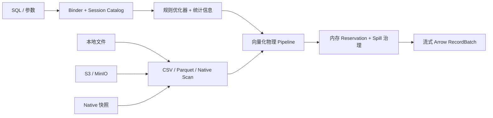

<div align="center">

# RustDB

**面向 CSV、Parquet、S3 与本地持久化分析的嵌入式单机 OLAP 引擎。**

[English](README.md) · [架构](docs/architecture.md) · [SQL 兼容范围](docs/compatibility.md) · [CLI 帮助](packaging/dist/CLI.zh-CN.md)

[](https://github.com/SamuelSupe/RustDB/actions/workflows/ci.yml)
[](https://github.com/SamuelSupe/RustDB/actions/workflows/dist.yml)
[](Cargo.toml)
[](rust-toolchain.toml)
[](LICENSE)

</div>

> [!WARNING]
> RustDB 目前仍是实验性的 alpha 软件，适合功能评估、开发与可复现的引擎研究；
> Native 存储格式和公开 API 尚未承诺生产级稳定性。

RustDB 可以直接查询本地磁盘或 S3-compatible 对象存储中的 CSV 和
Parquet，也可以把数据批量导入不可变分段的 Native 数据库，用于重复的本地分析。
Rust API 与 `rustdb` CLI 都以 Apache Arrow `RecordBatch` 流式返回结果。

SQL Binder、优化器、向量化算子、调度器、内存记账、Native 存储与 Spill
均由本项目实现；运行时不依赖 DataFusion，项目代码禁止使用 `unsafe`。

## 为什么是 RustDB？

- **直接查询数据源**：支持普通路径、glob、`file://`、AWS S3 和
  MinIO/S3-compatible endpoint。
- **高效列式路径**：投影/谓词下推、Parquet row-group/page-index/Bloom
  裁剪、运行时过滤器和元数据 singleflight。
- **高速 CSV**：支持原始、gzip、zstd 输入，并以 quote-aware framing
  安全地并行解析单个大文件。
- **Native 持久化分析**：支持原子批量导入、追加、整表替换、快照读取、
  重启恢复以及经过校验的本地备份/恢复。
- **资源受控执行**：多 lane pipeline、引擎/查询内存预算、有界队列、取消，
  以及受配额和磁盘余量治理的 Spill。
- **默认嵌入式**：提供稳定外层 Rust API 与流式 CLI，无需常驻服务进程。

## 能力概览

| 领域 | v0.7 alpha 当前范围 |
| --- | --- |
| 数据格式 | CSV、gzip CSV、zstd CSV、Parquet |
| 存储 | 本地文件系统、S3/MinIO、本地持久化 Native 数据库 |
| 接口 | 嵌入式 Rust API、`rustdb` CLI/REPL |
| 输出 | 流式 Apache Arrow `RecordBatch` |
| 执行 | 向量化、多 lane、内存记账、支持 Spill |
| SQL | 面向 TPC-H 的分析 SQL、Join、聚合、窗口、集合运算、参数化查询 |
| 安全 | 项目代码使用 `#![forbid(unsafe_code)]` |

准确的 SQL、类型和格式边界请以[兼容矩阵](docs/compatibility.md)为准。

## 快速开始

### 使用 OrbStack 构建发行包

默认开发与打包路径使用 OrbStack 的 Docker 引擎：

```sh
git clone https://github.com/SamuelSupe/RustDB.git
cd RustDB
scripts/dist/build.sh
```

命令会在 `dist/` 生成带版本号的压缩包和 SHA-256 文件，并验证中英文帮助、
安装、运行和卸载。已安装固定 Rust 工具链的原生主机可以运行
`scripts/dist/build.sh --native`，为当前平台构建。

### 直接查询文件

```sh
cargo run --locked --release --bin rustdb -- \
  --threads 4 \
  --memory-limit 2GiB \
  -c "SELECT count(*) FROM read_parquet('/data/events/*.parquet')"
```

```sql
SELECT country, count(*) AS events
FROM read_csv('/data/events/*.csv.gz', compression = 'auto')
WHERE event_date >= DATE '2026-01-01'
GROUP BY country
ORDER BY events DESC
LIMIT 20;
```

不传 `-c` 和 `-f` 会进入 REPL。输出格式包括 `table`、`csv` 和 `jsonl`。
可以运行 `rustdb --help`、`rustdb --help-zh`，或在 REPL 中执行 `.help zh`
查看双语帮助。

### 查询 S3 或 MinIO

AWS 凭证只从默认凭证链或嵌入应用提供的 credential provider 获取；RustDB
不会提供明文 secret CLI 参数。

```sh
AWS_PROFILE=analytics rustdb --s3-region us-east-1 -c \
  "SELECT count(*) FROM read_parquet('s3://analytics/events/*.parquet')"
```

```sh
rustdb \
  --s3-endpoint http://127.0.0.1:9000 \
  --s3-region us-east-1 \
  --s3-path-style \
  --s3-allow-http \
  -c "SELECT * FROM read_parquet('s3://demo/events/*.parquet') LIMIT 10"
```

AWS、匿名访问和 MinIO 配置请参阅 [S3 配置](docs/s3.md)。

## 嵌入 RustDB

```rust,no_run
use futures::StreamExt;
use rustdb::{Engine, EngineConfig, ParquetOptions};

# async fn run() -> rustdb::Result<()> {
let engine = Engine::new(EngineConfig::default())?;
let session = engine.session();

session
    .register_parquet(
        "events",
        ["/data/events/*.parquet"],
        ParquetOptions::default(),
    )
    .await?;

let mut result = session
    .execute("SELECT country, count(*) FROM events GROUP BY country")
    .await?;

while let Some(batch) = result.stream().next().await {
    println!("{:?}", batch?);
}
# Ok(())
# }
```

公开结果始终保持流式，是否收集以及何时收集由调用者决定。查询被取消或结果被
丢弃后，TaskGroup 会先收敛，再清理该查询的 Spill。

## Native 持久化数据库

`Engine::new` 是临时会话；`Engine::open` 会打开本地持久化数据库，可以直接从
CSV 或 Parquet 导入不可变分段：

```rust,no_run
use futures::StreamExt;
use rustdb::{Engine, EngineConfig};

# async fn import() -> rustdb::Result<()> {
let engine = Engine::open("./warehouse", EngineConfig::default())?;
let session = engine.session();

let mut write = session
    .execute(
        "CREATE TABLE events AS \
         SELECT * FROM read_parquet('/data/events/*.parquet')",
    )
    .await?;

while let Some(batch) = write.stream().next().await {
    batch?;
}
# Ok(())
# }
```

同时支持批量 `INSERT INTO ... SELECT` 与
`CREATE OR REPLACE TABLE ... AS SELECT`。Catalog 发布是原子的：进行中的查询
继续读取已固定的旧快照，后续查询看到新的 generation。Native 不是行式事务
数据库；行级 DML、MVCC 和通用事务不在当前范围内。

## 架构



Arrow `RecordBatch` 是统一交换格式。Scan、Filter、Projection 在安全时融合；
Aggregate、Join、Sort、Window 是受控的 pipeline breaker。内部 batch 携带内存
lease，通过有界队列传递。所有查询 worker 属于同一个可取消 TaskGroup；阻塞
算子无法取得 reservation 时会切换到分区 Spill。

完整执行模型请参阅[架构文档](docs/architecture.md)。

## 功能状态

- [`benchmarks/tpch`](benchmarks/tpch) 保留 TPC-H Q1-Q22 查询覆盖。
- v0.7 ClickBench 功能门禁在 4 CPU / 16 GiB 容器配置下运行 43 条官方查询一次。
- 已保留的 100 万行运行完成 **43/43 条查询**，证据见
  [`20260717-functional-1m-4c16g.json`](benchmarks/clickbench/evidence/20260717-functional-1m-4c16g.json)。

该 ClickBench 结果只用于验证功能完备性与可靠性，不是跨引擎性能声明。可选的
100M profile 和复现方法位于 [ClickBench 指南](benchmarks/clickbench/README.md)。

## 当前边界

RustDB 当前不提供行级 update/delete、schema alteration、通用事务、MVCC、服务
协议或分布式执行，也不承诺 DuckDB SQL/数据库文件兼容。JSON、ORC、Iceberg 和
Parquet 写入同样不在 v0.7 范围。没有最外层 `ORDER BY` 时，结果顺序不作保证。

## 文档

| 文档 | 内容 |
| --- | --- |
| [架构](docs/architecture.md) | Pipeline、调度、内存、裁剪、Native 存储与 Spill |
| [兼容范围](docs/compatibility.md) | SQL、类型、格式和明确限制 |
| [CLI 中文帮助](packaging/dist/CLI.zh-CN.md) / [English](packaging/dist/CLI.md) | 命令、输出、资源和 S3 参数 |
| [安装中文说明](packaging/dist/INSTALL.zh-CN.md) / [English](packaging/dist/INSTALL.md) | 二进制包安装与卸载 |
| [S3 与 MinIO](docs/s3.md) | 凭证、endpoint 和对象存储行为 |
| [故障排查](docs/troubleshooting.md) | 资源、Spill、损坏和输入错误 |
| [验收说明](docs/acceptance.md) | 正确性与版本发布检查 |
| [v0.7 迁移](docs/migration-v0.7.md) | 当前执行内核和 benchmark 变化 |

## 开发

完整默认验证使用 OrbStack：

```sh
scripts/ci/orbstack.sh all
```

也可以执行聚焦检查：

```sh
docker compose run --rm dev cargo fmt --check
docker compose run --rm dev cargo clippy --all-targets -- -D warnings
docker compose run --rm dev cargo test --all-targets
```

请保持算子和数据源模块职责单一，保留流式结果语义，不要引入项目自身的
`unsafe` 或 DataFusion 运行时依赖。

## 许可证

RustDB 使用 [Apache License 2.0](LICENSE)。
